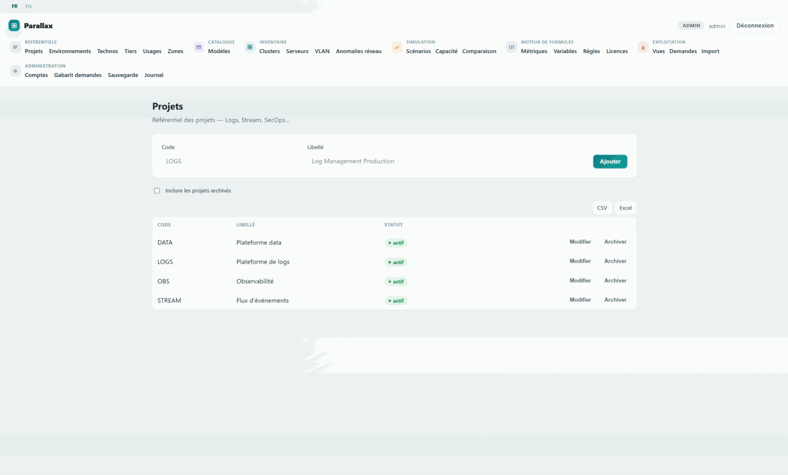

# Parallax

*[Français](README.md) · English*

> **Status: beta (v0.7).** Functionally complete and covered by tests,
> but not yet proven on a large real fleet or over time. The schema may
> still evolve, through additive migrations. Feedback is welcome through
> the *issues*.

Capacity planning and sizing-hypothesis management — CPU, RAM, disk,
licenses — for a team operating large-scale, on-premises data platforms.
The hardware inventory is not the starting point but what makes those
calculations checkable: comparing a computed need against the fleet
actually installed, without ever risking the real data while testing a
hypothesis.



*A tour of the tool in a few screens — the data is fictitious.*

## Why

In a large organization, this sizing work is almost always done in a
complex spreadsheet, often maintained by a single person: formulas broken
by a concurrent edit, no reliable history of what was assumed and why,
and above all no way to test a purchasing hypothesis without risking
damage to the real figures. Parallax keeps the same purpose — need
calculated against available hardware — but on a shared, conflict-free
database, with full history, and one simple principle: **every hypothesis
is a layer laid over the real data**, never a direct edit. You can build a
scenario, compare it, abandon it, pick up another one, with no re-entry
and no fear of having lost yesterday's version. The dated fleet inventory
and hardware catalogue follow from that: they're the reference data these
calculations need to be checkable, not an end in themselves.

## Features

- **Formula engine** — capacity calculation rules, variables resolved
  through a hierarchy of scopes, evaluated either per scope or per server.
- **Layered scenarios** — simulate without ever touching the real data,
  compare two hypotheses side by side, promote or abandon in one move.
- **Reverse sizing** — compare several candidate models against a target
  need, accounting for the installed fleet you choose to keep.
- **Software licenses** — tracking of units owed under different
  calculation modes, as just another column in the views.
- **Hardware requests** — automatic generation of the description to paste
  into the ordering tool, from a customizable template.
- **Dated inventory** — the snapshot of the fleet actually installed that a
  computed need is checked against, with the full history kept at every
  change.
- **Versioned hardware catalogue** — models, immutable revisions, components
  (cores, RAM, disks, network, GPU).
- **View builder** — the equivalent of pivot tables, free axes and filters,
  Excel export.
- **IP addressing** — VLAN catalogue, free-address suggestions, inconsistency
  detection that never blocks you.
- **Change log** — who changed what, when, with the before and after state.
- **Local or LDAP authentication**, CSV import and export — including bulk
  updates of existing servers.

The detail of every screen is in the
**[user guide](docs/guide-utilisateur.en.md)**.

## Requirements

- None, to use a ready-made binary (the repository's *Releases* page:
  Linux x64, Windows x64, macOS arm64)
- Go 1.26 or later, to build it yourself
- Python 3.8 or later (only to replay the executable specification, not
  needed to run the application)
- No database to install: SQLite is embedded

## Quick start

With a binary downloaded from the *Releases* page:

```sh
./parallax -base ./parallax.db
```

From source:

```sh
make check   # verifies everything: specification, build, vet, tests
make run     # runs the application on a local database, under ./data
```

On a fresh database, an administrator account is created automatically on
first start — the random password is printed once in the startup logs.
Once signed in, the **Import** screen offers five matching example CSV
files, so you can explore the application right away without preparing your
own data.

## Deploy

```sh
make release
./bin/parallax -base /var/lib/parallax/parallax.db -adresse :8080
```

`CGO_ENABLED=0` and a pure-Go SQLite driver: a binary built on Linux runs as
is on RHEL 8 or 9, with no dependency on the build machine's glibc. `-base`
and `-adresse` can also be set through environment variables
(`PARALLAX_BASE`, `PARALLAX_ADRESSE`) — convenient for a systemd unit. Full
deployment, periodic backup to S3-compatible storage, and LDAP
authentication: see **[`docs/deploiement.en.md`](docs/deploiement.en.md)**.

## Backup

```sh
./bin/parallax -base /var/lib/parallax/parallax.db \
  -sauvegarde /tmp/parallax-$(date +%F).db
```

`VACUUM INTO` produces a consistent copy without interrupting readers in
progress. The resulting file can be dropped directly onto S3-compatible
storage; an automatic periodic upload is also available (see the deployment
guide).

## Repository layout

```
cmd/parallax/             entry point
internal/capacity/        capacity engine — no external dependency
internal/db/               opening, embedded migrations, backup
internal/depot/            data access layer, one repository per entity
internal/auth/             local authentication (argon2id) and sessions
internal/ldap/              in-house LDAP client (simple bind over TLS)
internal/sauvegarde/       in-house S3 client (backup upload)
internal/web/               HTTP server, HTML templates, screens
internal/vues/              view builder — grouping, filters, aggregates
internal/xlsx/               minimal .xlsx writer, no dependency
internal/importation/       CSV bulk import and update
spec/                        executable specification and test vectors
docs/                        user guide, deployment, formats, technical reference
```

## Documentation

| Document | For | Français |
|---|---|---|
| [User guide](docs/guide-utilisateur.en.md) | Anyone using the application | [FR](docs/guide-utilisateur.md) |
| [Deployment](docs/deploiement.en.md) | Setup, backup, LDAP | [FR](docs/deploiement.md) |
| [Import formats](docs/import-format.en.md) | Preparing CSV files | [FR](docs/import-format.md) |
| [Changelog](CHANGELOG.en.md) | What each stage of the project brought | [FR](CHANGELOG.md) |
| [Contributing](CONTRIBUTING.en.md) | Developing on the project | [FR](CONTRIBUTING.md) |
| [Data model](docs/modele-donnees.en.md) | Technical reference for the schema, for contributors | [FR](docs/modele-donnees.md) |

## The executable specification

`spec/capacity_reference.py` is the reference implementation of the capacity
engine. It produces `spec/vectors.json`, which the Go tests consume as is.
The reference is authoritative: any divergence is a bug on the Go side.
`spec/validate_schema.py` runs the schema under SQLite against a
representative dataset and checks the trickiest queries. Details in
[`CONTRIBUTING.en.md`](CONTRIBUTING.en.md).

## License

Parallax is distributed under the
**[GNU Affero General Public License v3.0](LICENSE)** (AGPLv3): free to use,
study, modify and redistribute, provided the source code — including your
modifications — remains available under the same terms, including when the
tool is exposed over a network (it is a web server).

> **Note of intent, not legally binding**: this project was born for a
> specific internal use and is published on the idea that it could serve as
> a starting point for other teams in a comparable situation — a capacity
> sizing exercise that had become hard to maintain in a shared spreadsheet. Any
> data specific to its original context has been removed before
> publication. This is a share, not a product: I would ask that it not be
> resold commercially, as is or in a derived form.

## Disclaimer

Parallax is published **as is**, without warranty of any kind (see sections
15 to 17 of the [AGPLv3](LICENSE), which are authoritative). In particular,
the figures produced by the capacity engine depend entirely on the rules and
variables you feed into it: check them against your own references before
relying on them for a purchasing decision.
